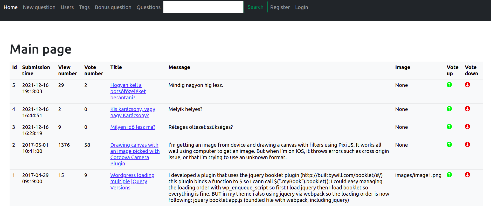

# Ask-mate
- This is our first web application on Python/Flask with PostgreSQL database.
- It allows you to ask questions or answer other users just like on gyakorikérdések or stackowerflow:)

## Technology

- Python / Flask
- PostgreSQL
- HTML, CSS
- Javascript (!used for the first time)

## Getting Started

- Clone the repository using the command git clone `https://github.com/kovesdieszter/Ask-mate.git`.
- Install all necessary packages asked by your IDE.
- Run `server.py`

